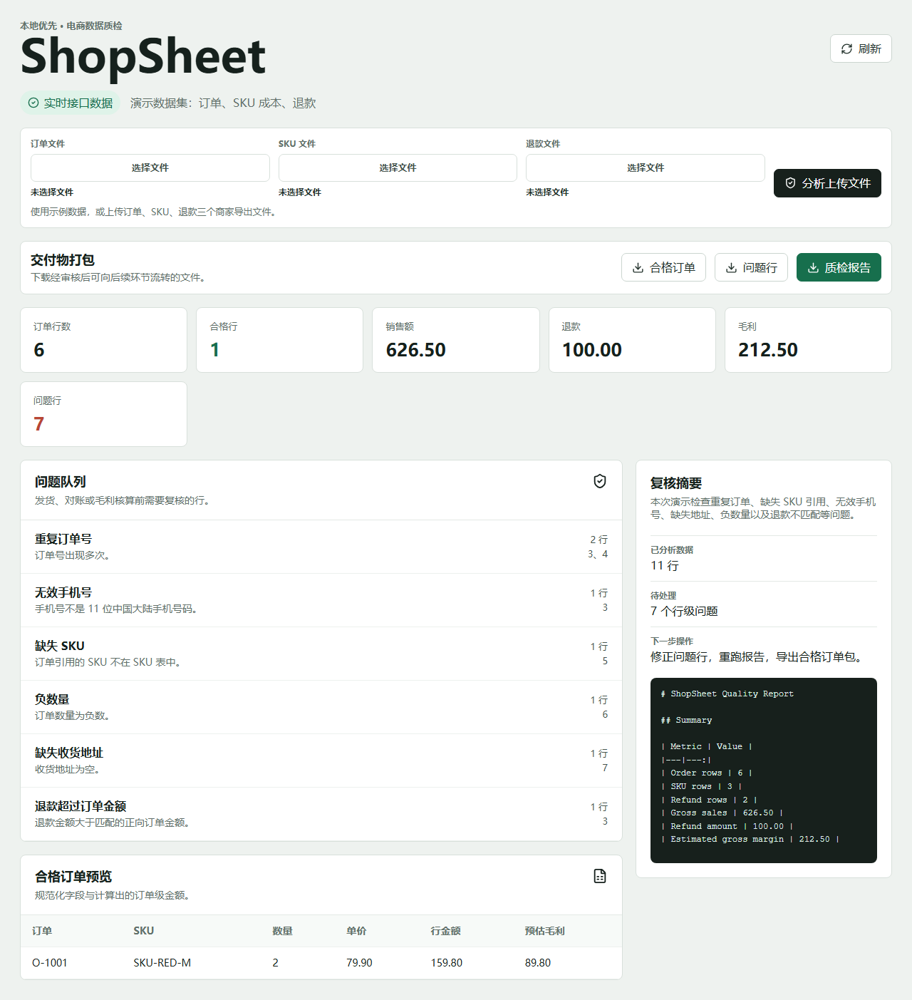

# ShopSheet

ShopSheet is a local-first spreadsheet quality workbench for small ecommerce merchants. It turns exported order, SKU, and refund files into clean order rows, issue queues, and a reviewable business report.

## Why It Exists

Small merchants often reconcile marketplace exports in Excel before shipping, refund review, and margin checks. A few dirty rows can cause wrong shipments, mismatched refunds, or misleading profit numbers. ShopSheet makes that review repeatable.

## Current Product Slice

- Import order, SKU, and refund tables from CSV/XLSX.
- Normalize common English and Chinese merchant export headers.
- Detect duplicate orders, missing SKU references, invalid phone values, missing addresses, negative quantities, and refund mismatches.
- Calculate gross sales, refund amount, and estimated gross margin.
- Expose the analysis through a FastAPI backend.
- Provide a React operator workspace with KPI summary, issue queue, clean order preview, and upload flow.
- Download merchant deliverables: clean orders CSV, issue rows CSV, and Markdown quality report.
- Reject oversized uploads before table parsing to keep local runs predictable.

## Screenshot



## Quick Start

Backend (macOS, Linux, and Windows):

```bash
python -m pip install -e ".[dev]"
uvicorn shopsheet.api:app --reload --host 127.0.0.1 --port 8000
```

Frontend:

```bash
cd frontend
npm ci
npm run dev
```

Open `http://127.0.0.1:5173`.

If port `8000` is already occupied, start the backend on another port and point Vite to it.

macOS / Linux:

```bash
PYTHONPATH=src python -m uvicorn shopsheet.api:app --host 127.0.0.1 --port 8001

cd frontend
VITE_API_PROXY="http://127.0.0.1:8001" npm run dev -- --port 5173
```

Windows (PowerShell):

```powershell
$env:PYTHONPATH="src"
python -m uvicorn shopsheet.api:app --host 127.0.0.1 --port 8001

cd frontend
$env:VITE_API_PROXY="http://127.0.0.1:8001"
npm run dev -- --port 5173
```

Windows helper scripts (optional) — write logs/PID metadata under `.runtime/`:

```powershell
.\scripts\start-dev.ps1
.\scripts\stop-dev.ps1
```

## Validation

Backend tests (any OS):

```bash
python -m pytest -q
python -m ruff check src tests
```

Frontend build and browser workflow (any OS):

```bash
cd frontend
npm audit --audit-level=high
npm run build
npm run e2e -- --reporter=line
```

Docker runtime — macOS / Linux:

```bash
(cd frontend && npm run build)
SHOPSHEET_BACKEND_PORT=18000 SHOPSHEET_FRONTEND_PORT=15173 docker compose up -d --build
```

Docker runtime — Windows (PowerShell):

```powershell
cd frontend
npm run build
cd ..
$env:SHOPSHEET_BACKEND_PORT="18000"
$env:SHOPSHEET_FRONTEND_PORT="15173"
docker compose up -d --build
```

Open `http://127.0.0.1:15173` for the Docker-served frontend.

Windows full-verification helpers (optional) — `verify.ps1` runs the full local gate; pass `-SkipAudits` when PyPI/OSV/npm endpoints are blocked:

```powershell
.\scripts\verify.ps1
.\scripts\verify.ps1 -SkipAudits
.\scripts\smoke-docker.ps1
```

## API

- `GET /health`
- `GET /api/demo-report`
- `GET /api/demo-export/{filename}`
- `POST /api/analyze`

`POST /api/analyze` expects multipart files named:

- `order_file`
- `sku_file`
- `refund_file`

Each uploaded file is limited to 5 MB in the local showcase build.

Demo export filenames:

- `clean_orders.csv`
- `issue_rows.csv`
- `quality_report.md`

## Deliverables

- `clean_orders.csv` contains order rows that passed every quality check, plus calculated amount and margin columns.
- `issue_rows.csv` contains one row per detected issue and source row; the same order can appear multiple times when it has multiple issues.
- `quality_report.md` summarizes metrics and issue counts for review.

These deliverables answer different review questions, so their row counts are not expected to add up to each other.

## Metrics

`estimated_gross_margin` is a rough estimate: order rows with unknown SKU cost are excluded from margin contribution, and refunds are deducted by total refund amount.

## Example Data

Synthetic merchant files live in `examples/`:

- `orders_messy.csv`
- `skus.csv`
- `refunds.csv`
- `orders_chinese_headers.csv`
- `skus_chinese_headers.csv`
- `refunds_chinese_headers.csv`

They are safe to publish and designed to trigger realistic quality issues.

## Project Structure

```text
src/shopsheet/        Python data core and FastAPI app
tests/                Backend behavior tests
examples/             Synthetic merchant exports
frontend/             React/Vite operator workspace
docs/                 Product brief and architecture notes
.github/workflows/    CI checks
```

## Non-Goals

ShopSheet is not a full ERP, payment system, marketplace authorization layer, or multi-tenant SaaS. The project stays focused on a polished, testable spreadsheet operations workflow.

## Safety

Do not commit real merchant exports, customer data, marketplace tokens, or payment credentials. The repository uses synthetic data only.
